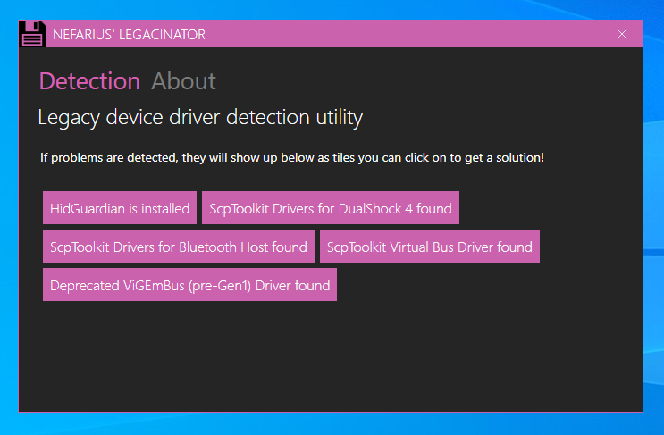
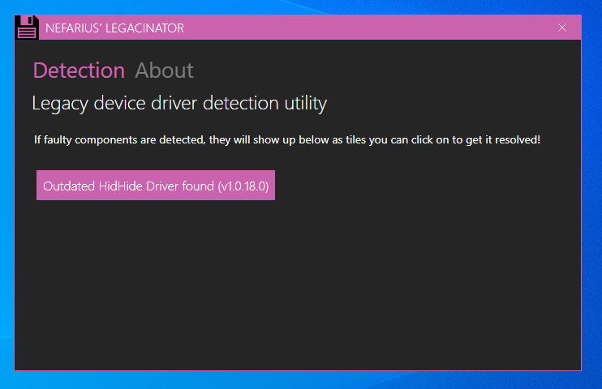
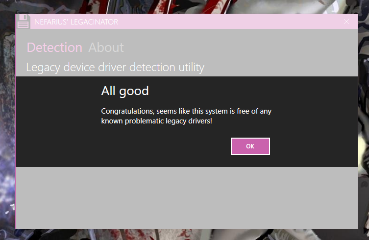

# Nefarius' Legacinator

 

The one and only Legacinator.

## About

Ever wondered why that darn game controller just won't show up in games, Steam or your favourite emulator? Machine
crashes once you plug in a DualShock 3/4? Struggling with getting that lid off of your pickles jar? Well, I can't help
you with that, but for the game controller issues, read on!

The Legacinator is a simple self-contained .NET 4.8 application that has one task: it scans your machine for traces of
known legacy (outdated, potentially faulty) device drivers (leftovers
from [ScpToolkit](https://github.com/nefarius/ScpToolkit), outdated [ViGEmBus](https://github.com/ViGEm/ViGEmBus) copies
etc.) and provides a solution to the user.

## Features

- Detects and removes drivers from [ScpToolkit](https://github.com/nefarius/ScpToolkit) installations
- Detects and removes [HidGuardian](https://github.com/ViGEm/HidGuardian)
- Detects and removes outdated versions of [ViGEmBus](https://github.com/nefarius/ViGEmBus)
- Detects and removes outdated versions of [HidHide](https://github.com/nefarius/HidHide)
- Detects the [HP fork of ViGEmBus from 2018](https://github.com/ViGEm/ViGEmBus/issues/99) and offers mitigation
  instructions
- Detects and fixes [outdated updater agent configuration](https://docs.nefarius.at/projects/ViGEm/End-of-Life/). 

## Environment

This tool was built for **Windows 10** or later. Anything lower might work but is not supported. Since .NET 4.8 ships
with Windows, the tool should be ready to run once downloaded.

## Download

👉 [Get the latest signed release from here](../../releases/latest). Use at your own risk. No support provided
whatsoever.

## Screenshots

Usage examples

If you run the tool on a machine with legacy components, the window will fill up with one or more tiles listing
components found:

Clicking them will either attempt an instant automatic fix or open a link to online articles on how to get rid of them
in a safe and supported way. A few more detection examples:

On a "clean" machine you simply get a success dialog:

## Sources & 3rd party credits

- [MahApps.Metro](https://github.com/MahApps/MahApps.Metro)
- [Fody Costura](https://github.com/Fody/Costura)
- [Nefarius.Utilities.DeviceManagement](https://github.com/nefarius/Nefarius.Utilities.DeviceManagement)
- [INI File Parser](https://github.com/rickyah/ini-parser)
